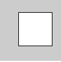
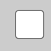
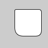
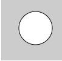
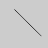
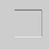
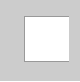
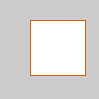
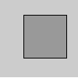
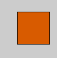

# Processing Notes
 
[Processing Basics](#basics)

[Shape](#shape)

[Function](#function)

[Color](#color)

[Array](#array)

## Processing Basics 
[Top](#top)

Processing uses functions to create visuals.  
### Terminology  
#### Stroke    

Outline of a shape
stroke can set the color or set the with of the line.

Syntax:

	strokeWeight(weight);

weight: float the weight of the stroke  
Return type: void

#### Fill

Anything inside of stroke.

### Rules

* When there are multiple codes, first code will be dislpayed on the bottom, later codes will be displayed on top of the previous ones.  
* To color a shape, call color function before the defining the shape.

### Setup and Draw
#### Setup

It happens only once at the beginnig of the sketch.  
Syntax:

	void setup(){
	}

* Set the size of canvas

#### Draw

It loops.  
Syntax:

	void draw(){
	}

* Don't forget to include background(); in the draw function to refresh the background. Otherwise it'll keep drawing new shapes on top.

## Shape
[Top](#top)

##### Rectangle

Syntax: 

	rect(a, b, c, d);

a: float x-coordiante of upper-left corner  
b: float y-coordiante of upper-left corner  
c: float width  
d: float height   
Return type: void   
 rect(30, 20, 55, 55);

Syntax: 

	rect(a, b, c, d, r);

r: float radii for all corners  
 rect(30, 20, 55, 55, 7);  
Syntax:

	rect(a, b, c, d, tl, tr, br, bl);

tl: float radius for top-left  
tr: float radius for top-right  
br: float radius for bottom-right  
bl: float radius for bottom-left  
 rect(30, 20, 55, 55, 3, 6, 12, 18);

##### Ellipse

Syntax:

	ellipse(a, b, c, d);

a: float x-coordinate (center)

b: float y-coordinate (center)

c: float width (diameter)

d: float height (diameter)

Return type: void

 ellipse(56, 46, 55, 55);

##### line

Syntax:

	line(x1, y1, x2, y2);
	line(x1, y1, z1, x2, y2, z2);

x1: float 1st x-coordinate

y1: float 1st y-coordinate

x2: float 2nd x-coordinate

y2: float 2nd y-coordinate

z1: float 1st z-coordinate

z2: float 2nd z-coordinate

 line(30, 20, 85, 75)

 line(30, 20, 85, 20); stroke(126); line(85, 20, 85, 75);
stroke(255); line(85, 75, 30, 75);

 // Drawing lines in 3D requires P3D // as a parameter to size() size(100, 100, P3D); line(30, 20, 0, 85, 20, 15); stroke(126); line(85, 20, 15, 85, 75, 0); stroke(255); line(85, 75, 0, 30, 75, -50);

## Function 
[Top](#top)

##### SelectInput

It lets user to open a new window and browse the file to select a file to use.

Example:

	void setup(){
		selectInput("Select a file to process:", "fileSelected");
	}

	void fileSelected(File selection){
		if(selection == null){
			println("Window was closed or the user hit cancel.");
		} else{
			println("User selected " + selection.getAbsolutePath());
		}
	}

Syntax:

	selectInput(prompt, callback);
	selectInput(prompt, callback, file);
	selectInput(prompt, callback, file, callbackObject);
	selectInput(prompt, callback, file, callbackObject, parent, sketch);
	selectInput(prompt, callback, file, callbackObject, parent);

prompt: string a message to dislpay
callback: string name of the method for the selection

Return type: void

##### loadStrings

It reads the contents of a file and creates a string array of individual lines in the file.

Examples:
		
	String[] lines = loadStrings("list.txt");
	println("there are " + lines.length + " lines");
	for (int i = 0 ; i < lines.length; i++) {
	  println(lines[i]);
	}

Syntax:

	loadStrings(filename);
	loadStrings(reader);

filename: string name of the file or URL

Return type: String()

##### split

This function breaks a string into pieces by the given character or string as a delimiter.

Exaples:

		
	String men = "Chernenko,Andropov,Brezhnev";
	String[] list = split(men, ',');
	// list[0] is now "Chernenko", list[1] is "Andropov"...

Syntax:

	split(value, delim);

value: string the string to be split
delim: char the character or string to separate the string

Return type: string[]

## Color
[Top](#top)

##### Outline color

Syntax:

	stroke(rgb);
	stroke(gray);

rgb: int rgb in hexadecial

gray: float a value between black adn white (0 = black, 255 = white)

Return type: void

 stroke(153); rect(30, 20, 55, 55);

Syntax:

	stroke(rgb, alpha);
	stroke(gray, alpha);

alpha: float opacity of the outline

Syntax:

	stroke(v1, v2, v3);
	stroke(v1, v2, v3, alpha);

v1: float red or hue value

v2: float green or saturation value

v3: float blue or brightness value

 stroke(204, 102, 0); rect(30, 20, 55, 55);

##### color inside of a shape

Syntax:

	fill(rgb);
	fill(gray);

rgb: int rgb in hexadecial

gray: float a value between black adn white (0 = black, 255 = white)

Return type: void

 fill(153); rect(30, 20, 55, 55);

Syntax:

	fill(rgb, alpha);
	fill(gray, alpha);

alpha: float opacity of the outline

Syntax:

	fill(v1, v2, v3);
	fill(v1, v2, v3, alpha);

v1: float red or hue value

v2: float green or saturation value

v3: float blue or brightness value

 fill(204, 102, 0); rect(30, 20, 55, 55);

##### Background color

Syntax:

	background(rgb);
	background(gray);

rgb: int rgb in hexadecial

gray: float a value between black adn white (0 = black, 255 = white)

Return type: void

 background(51);

Syntax:

	background(rgb, alpha);
	background(gray, alpha);

alpha: float opacity of the outline

Syntax:

	background(v1, v2, v3);
	background(v1, v2, v3, alpha);

v1: float red or hue value

v2: float green or saturation value

v3: float blue or brightness value

 background(255, 204, 0);

Syntax:

	background(image);

image: PImage for the background (must be the same size as the sketch window)

 PImage img; img = loadImage("laDefence.jpg"); background(img);

## Array
[Top](#top)

To find the length of the array

	arr.length

