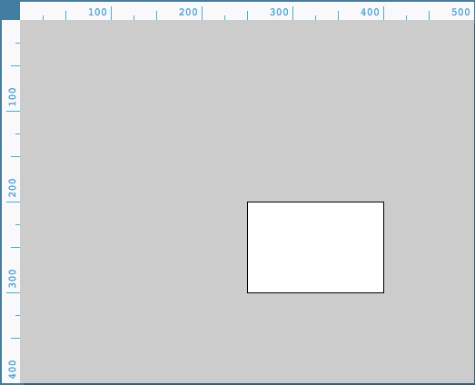

# Processing Notes

### [Processing Basics](#basics)

<a name="basics">
### ------------------------------------------------------------

# Processing Basics
</a>
### ------------------------------------------------------------

Processing uses functions to create visuals.

### Rules

When there are multiple codes, first code will be dislpayed on the bottom, later codes will be displayed on top of the previous ones.

### Function

###### Rectangle

Syntax: rect(a, b, c, d);
a: float x-coordiante of upper-left corner
b: float y-coordiante of upper-left corner
c: float width
d: float height
Return type: void

	rect(250, 200, 150, 100);

To create a ellipse: ellipse(x-coordinate(center of the circle), y-coordinate(center), width of diameter, height of diameter);

	ellipse(250, 200, 300, 300);

