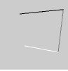

# Processing Notes
 
[Processing Basics](#basics)  
	[Stroke](#stroke), [Fill](#fill), [setup()](#setup), [draw()](#draw)  

[Shape](#shape)  
	[Rectangle](#rectangle), [Ellipse](#ellipse), [Line](#line), [Point(dot)](#point)  

[Function](#function)

[Draw Function](#draw_function)

[Color](#color)

[Array](#array)

[Map](#map)

[Table](#table)

## Processing Basics 
[Top](#top)

Processing uses functions to create visuals.  
### Terminology  

#### Stroke    

Outline of a shape
stroke can set the color or set the with of the line.

Syntax:

	strokeWeight(weight);

weight: float the weight of the stroke  
Return type: void

#### Fill  

Anything inside of stroke.

### Rules  

* When there are multiple codes, first code will be dislpayed on the bottom, later codes will be displayed on top of the previous ones.  
* To color a shape, call color function before the defining the shape.

### Setup and Draw

#### Setup  

It happens only once at the beginnig of the sketch.  
Syntax:

	void setup(){
	}

* Set the size of canvas

#### Draw  

It loops.  
Syntax:

	void draw(){
	}

* Don't forget to include background(); in the draw function to refresh the background. Otherwise it'll keep drawing new shapes on top.

## Shape
[Top](#top)

#### Rectangle  

Syntax: 

	rect(a, b, c, d);

a: float x-coordiante of upper-left corner  
b: float y-coordiante of upper-left corner  
c: float width  
d: float height   
Return type: void   
 rect(30, 20, 55, 55);

Syntax: 

	rect(a, b, c, d, r);

r: float radii for all corners  
 rect(30, 20, 55, 55, 7);  
Syntax:

	rect(a, b, c, d, tl, tr, br, bl);

tl: float radius for top-left  
tr: float radius for top-right  
br: float radius for bottom-right  
bl: float radius for bottom-left  
 rect(30, 20, 55, 55, 3, 6, 12, 18);

#### Ellipse  

Syntax:

	ellipse(a, b, c, d);

a: float x-coordinate (center)  
b: float y-coordinate (center)  
c: float width (diameter)  
d: float height (diameter)  
Return type: void  
 ellipse(56, 46, 55, 55);

#### line  

Syntax:

	line(x1, y1, x2, y2);
	line(x1, y1, z1, x2, y2, z2);

x1: float 1st x-coordinate  
y1: float 1st y-coordinate  
x2: float 2nd x-coordinate  
y2: float 2nd y-coordinate  
z1: float 1st z-coordinate  
z2: float 2nd z-coordinate  
 line(30, 20, 85, 75)

 line(30, 20, 85, 20); stroke(126); line(85, 20, 85, 75);
stroke(255); line(85, 75, 30, 75);

 // Drawing lines in 3D requires P3D // as a parameter to size() size(100, 100, P3D); line(30, 20, 0, 85, 20, 15); stroke(126); line(85, 20, 15, 85, 75, 0); stroke(255); line(85, 75, 0, 30, 75, -50);

#### Point (dot)

Syntax:

	point(x, y);
	point(x, y, z);

x: float x-coordinate of the point
y: float y-coordinate of the point
z: float z-coordinate of the point
Return type: void

## Function 
[Top](#top)

#### SelectInput  

It lets user to open a new window and browse the file to select a file to use.

Example:

	void setup(){
		selectInput("Select a file to process:", "fileSelected");
	}

	void fileSelected(File selection){
		if(selection == null){
			println("Window was closed or the user hit cancel.");
		} else{
			println("User selected " + selection.getAbsolutePath());
		}
	}

Syntax:

	selectInput(prompt, callback);
	selectInput(prompt, callback, file);
	selectInput(prompt, callback, file, callbackObject);
	selectInput(prompt, callback, file, callbackObject, parent, sketch);
	selectInput(prompt, callback, file, callbackObject, parent);

prompt: string a message to dislpay  
callback: string name of the method for the selection  
Return type: void

#### loadStrings  

It reads the contents of a file and creates a string array of individual lines in the file.

Examples:
		
	String[] lines = loadStrings("list.txt");
	println("there are " + lines.length + " lines");
	for (int i = 0 ; i < lines.length; i++) {
	  println(lines[i]);
	}

Syntax:

	loadStrings(filename);
	loadStrings(reader);

filename: string name of the file or URL  
Return type: String()  

#### split

This function breaks a string into pieces by the given character or string as a delimiter.

Exaples:

		
	String men = "Chernenko,Andropov,Brezhnev";
	String[] list = split(men, ',');
	// list[0] is now "Chernenko", list[1] is "Andropov"...

Syntax:

	split(value, delim);

value: string the string to be split  
delim: char the character or string to separate the string  
Return type: string[]

#### max()

Syntax:

	max(a, b);
	max(a, b, c);
	max(list);

a: float or int first number to compare  
b: float or int sencond number to compare 
c: float or int thirs number to compare  
list: float[] or int[] array of numbers to compare  

## Draw Function
[Top](#top)

#### text()

Syntax:

	text(c, x, y);
	text(str, x, y);

c: char the alphanumeric character to be displayed  
x: float x-coordinate  
y: float y-coordinate  
str: string

## Color
[Top](#top)

#### Outline color

Syntax:

	stroke(rgb);
	stroke(gray);

rgb: int rgb in hexadecial  
gray: float a value between black adn white (0 = black, 255 = white)  
Return type: void  
 stroke(153); rect(30, 20, 55, 55);

Syntax:

	stroke(rgb, alpha);
	stroke(gray, alpha);

alpha: float opacity of the outline

Syntax:

	stroke(v1, v2, v3);
	stroke(v1, v2, v3, alpha);

v1: float red or hue value  
v2: float green or saturation value  
v3: float blue or brightness value  
 stroke(204, 102, 0); rect(30, 20, 55, 55);

#### color inside of a shape

Syntax:

	fill(rgb);
	fill(gray);

rgb: int rgb in hexadecial  
gray: float a value between black adn white (0 = black, 255 = white)  
Return type: void  
 fill(153); rect(30, 20, 55, 55);  

Syntax:

	fill(rgb, alpha);
	fill(gray, alpha);

alpha: float opacity of the outline  
Syntax:

	fill(v1, v2, v3);
	fill(v1, v2, v3, alpha);

v1: float red or hue value  
v2: float green or saturation value  
v3: float blue or brightness value  
 fill(204, 102, 0); rect(30, 20, 55, 55);  

#### Background color

Syntax:

	background(rgb);
	background(gray);

rgb: int rgb in hexadecial  
gray: float a value between black adn white (0 = black, 255 = white)  
Return type: void  
 background(51);

Syntax:

	background(rgb, alpha);
	background(gray, alpha);

alpha: float opacity of the outline  
Syntax:  

	background(v1, v2, v3);
	background(v1, v2, v3, alpha);

v1: float red or hue value  
v2: float green or saturation value  
v3: float blue or brightness value  
 background(255, 204, 0);

Syntax:

	background(image);

image: PImage for the background (must be the same size as the sketch window)  
 PImage img; img = loadImage("laDefence.jpg"); background(img);

## Array
[Top](#top)

To find the length of the array

	arr.length

## Map
[Top](#top)

Re-maps a number from one range to another  
It will convert the input number accoring to the given range as an output.

Syntax:

	map(value, start1, stop1, start2, stop2)

value: float the incoming value to be converted  
start1: float lower bound of the value's current range  
stop1: float upper bound of the value's current range  
start2: float lower bound of the value's target range  
stop2: float upper bound of the value's target range  
Return type: float

## Table
[Top](#top)

#### getFloat()

It return a float value from the table's specified row and column.

Syntax:

	.getFloat(row, column)
	.getFloat(row, columnName)

row: int ID number of the row to reference
column: int ID number of the column to reference
columnName: String title of the column to reference
Return type: float

Example:

	Table table;

	void setup() {

	  table = new Table();
	  
	  table.addColumn("number", Table.INT);
	  table.addColumn("mass", Table.FLOAT);
	  table.addColumn("name", Table.STRING);
	  
	  table.addRow();  // Creates an empty row
	  
	  table.setInt(0, "number", 8);
	  table.setFloat(0, "mass", 15.9994);
	  table.setString(0, "name", "Oxygen");
	  
	  println(table.getInt(0, "number"));   // Prints 8
	  println(table.getFloat(0, "mass"));   // Prints 15.9994
	  println(table.getString(0, "name"));  // Prints "Oxygen"
	}

#### getString()

It returns a string from a table at specified row and column.  

Syntax:

	.getString(row, column);
	.getString(row, columnName);

row: int ID numeber of the row to reference  
column: int ID number of the column to refrence  
columnName: String title of the column to reference  
Return type: String

Example:

Table table;

void setup() {

	  table = new Table();
	  
	  table.addColumn("number", Table.INT);
	  table.addColumn("mass", Table.FLOAT);
	  table.addColumn("name", Table.STRING);
	  
	  table.addRow();  // Creates an empty row
	  
	  table.setInt(0, "number", 8);
	  table.setFloat(0, "mass", 15.9994);
	  table.setString(0, "name", "Oxygen");
	  
	  println(table.getInt(0, "number"));   // Prints 8
	  println(table.getFloat(0, "mass"));   // Prints 15.9994
	  println(table.getString(0, "name"));  // Prints "Oxygen"
	}

